.. code:: ipython3

    import pandas as pd
    import numpy as np
    from glob import glob # used to retrieve files/pathnames matching a specified pattern
    import cv2
    import matplotlib.pylab as plt

.. code:: ipython3

    cat_files=glob('img.jpg')
    dog_files=glob('img1.jpg')

.. code:: ipython3

    img_mp1=plt.imread(cat_files[0])
    img_cv2=cv2.imread(cat_files[0])
    img_mp1.shape,img_cv2.shape

.. parsed-literal::

    ((867, 1300, 3), (867, 1300, 3))

.. code:: ipython3

    img_mp1.max

.. parsed-literal::

    <function ndarray.max>

.. code:: ipython3

    pd.Series(img_mp1.flatten()).plot(kind='hist',bins=50,title='Distribution of pixel values')
    plt.show()

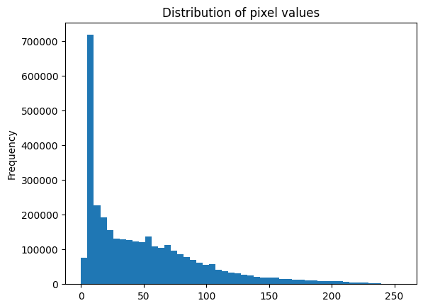

.. code:: ipython3

    fig,ax=plt.subplots(figsize=(10,10))
    ax.imshow(img_mp1)
    ax.axis('off')
    plt.show()

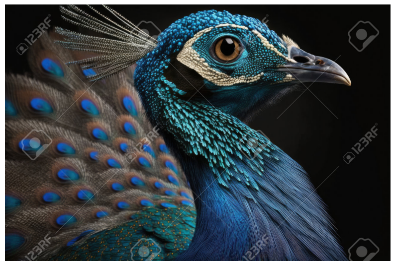

.. code:: ipython3

    img_mp1

.. parsed-literal::

    array([[[ 7,  7,  5],
            [ 7,  7,  5],
            [ 7,  7,  5],
            ...,
            [ 6,  6,  4],
            [ 6,  6,  4],
            [ 6,  6,  4]],
    
           [[ 7,  7,  5],
            [ 7,  7,  5],
            [ 7,  7,  5],
            ...,
            [ 6,  6,  4],
            [ 6,  6,  4],
            [ 6,  6,  4]],
    
           [[ 7,  7,  5],
            [ 7,  7,  5],
            [ 7,  7,  5],
            ...,
            [ 6,  6,  4],
            [ 6,  6,  4],
            [ 6,  6,  4]],
    
           ...,
    
           [[11, 10,  6],
            [12, 11,  7],
            [13, 12,  8],
            ...,
            [ 8,  8,  6],
            [ 8,  8,  6],
            [ 7,  7,  5]],
    
           [[11, 10,  6],
            [13, 12,  8],
            [14, 13,  9],
            ...,
            [ 8,  8,  6],
            [ 8,  8,  6],
            [ 7,  7,  5]],
    
           [[11, 10,  6],
            [13, 12,  8],
            [15, 14, 10],
            ...,
            [ 8,  8,  6],
            [ 8,  8,  6],
            [ 7,  7,  5]]], dtype=uint8)

.. code:: ipython3

    fig, axs=plt.subplots(1, 3, figsize=(15, 5))
    axs[0].imshow(img_cv2[:,:,0], cmap='Reds')
    axs[1].imshow(img_cv2[:,:,1], cmap='Greens')
    axs[2].imshow(img_cv2[:,:,2], cmap='Blues')
    axs[0].axis('off')
    axs[1].axis('off')
    axs[2].axis('off')
    axs[0].set_title('Red channel')
    axs[1].set_title('Green channel')
    axs[2].set_title('Blue channel')
    plt.show()

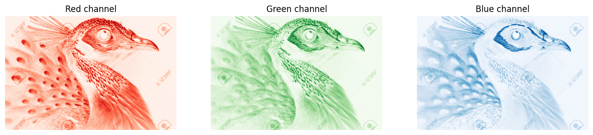

.. code:: ipython3

    fig, axs=plt.subplots(1, 2, figsize=(10, 5))
    axs[0].imshow(img_cv2)
    axs[1].imshow(img_mp1)
    axs[0].axis('off')
    axs[1].axis('off')
    axs[0].set_title('cv2 Image')
    axs[1].set_title('Matplotlib Image')
    plt.show()

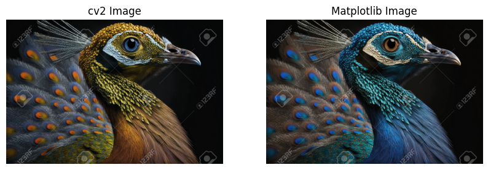

.. code:: ipython3

    img_cv2_rgb=cv2.cvtColor(img_cv2,cv2.COLOR_BGR2RGB)
    fig, ax=plt.subplots()
    ax.imshow(img_cv2_rgb)
    ax.axis('off')
    plt.show()

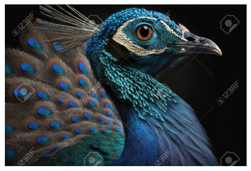

.. code:: ipython3

    img=plt.imread(dog_files[0])
    fig, ax=plt.subplots(figsize=(10,10))
    ax.imshow(img)
    ax.axis('off')
    plt.show()

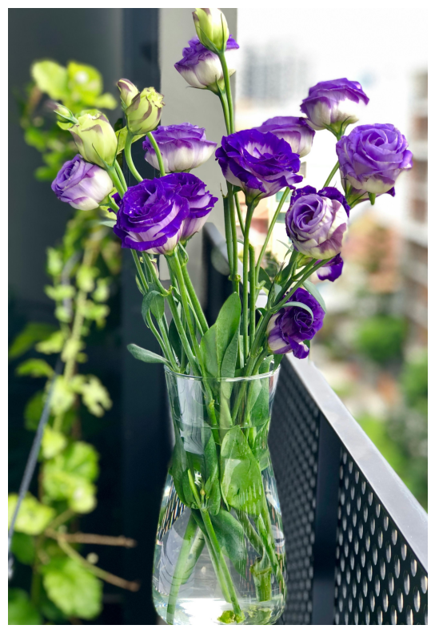

.. code:: ipython3

    img_gray = cv2.cvtColor(img, cv2.COLOR_BGR2GRAY)
    fig, ax=plt.subplots(figsize=(8, 8))
    ax.imshow(img_gray, cmap='Greys')
    ax.axis('off')
    ax.set_title('Grey Image')
    plt.show()

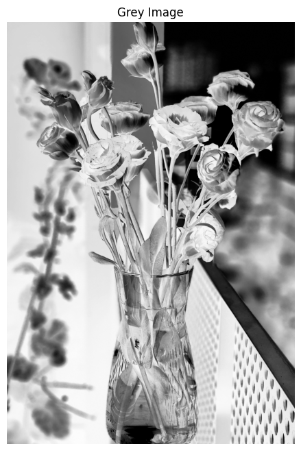

.. code:: ipython3

    img_resized=cv2.resize(img,None,fx=0.25,fy=0.25)
    fig, ax=plt.subplots(figsize=(8, 8))
    ax.imshow(img_resized)
    ax.axis('off')
    plt.show()

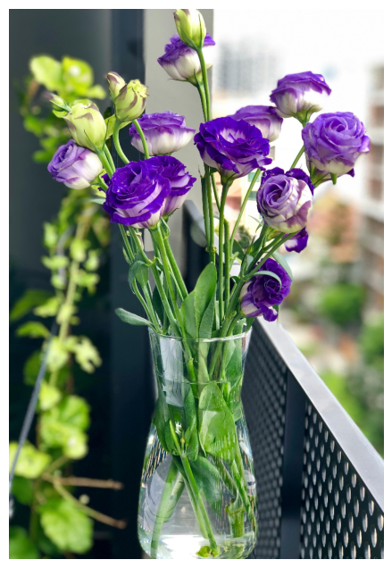

.. code:: ipython3

    img_resized.shape

.. parsed-literal::

    (960, 654, 3)

.. code:: ipython3

    img_resize=cv2.resize(img, (100, 200))
    fig, ax=plt.subplots(figsize=(8,8))
    ax.imshow(img_resize)
    ax.axis('off')
    plt.show()

.. code:: ipython3

    img_resize=cv2.resize(img, (5000, 5000),interpolation=cv2.INTER_CUBIC)
    fig, ax=plt.subplots(figsize=(8,8))
    ax.imshow(img_resize)
    ax.axis('off')
    plt.show()

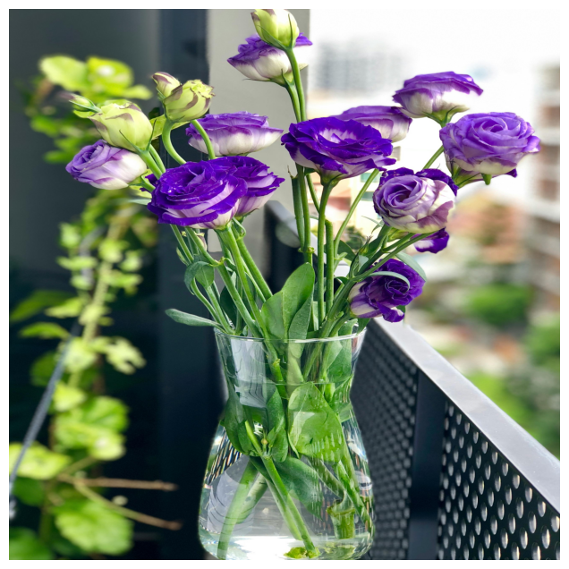

.. code:: ipython3

    kernel_shapening=np.array([[1,0,-1],
                               [0,0,0],
                               [-1.,0,1]])
    sharpened=cv2.filter2D(img,-1,kernel_shapening)
    fig, ax=plt.subplots(figsize=(8,8))
    ax.imshow(sharpened)
    ax.axis('off')
    ax.set_title('Sharpenend Image')
    plt.show()

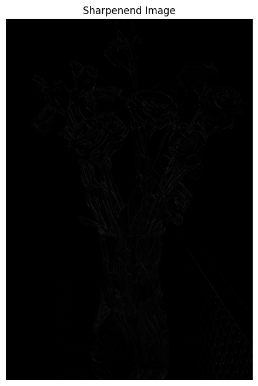

.. code:: ipython3

    kernel_shapening=np.array([[-1,-1,-1],
                               [-1,9,-1],
                               [-1.,-1,-1]])
    sharpened=cv2.filter2D(img,-1,kernel_shapening)
    fig, ax=plt.subplots(figsize=(8,8))
    ax.imshow(sharpened)
    ax.axis('off')
    ax.set_title('Sharpenend Image')
    plt.show()

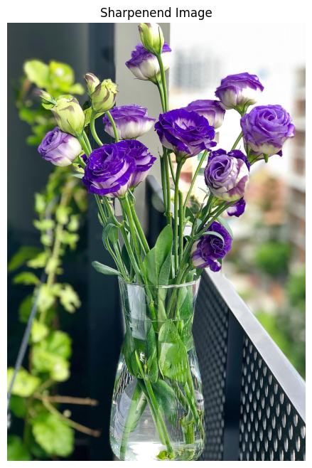

.. code:: ipython3

    kernel_shapening=np.array([[0,0,0],
                               [0,1,0],
                               [0,0,0]])
    sharpened=cv2.filter2D(img,-1,kernel_shapening)
    fig, ax=plt.subplots(figsize=(8,8))
    ax.imshow(sharpened)
    ax.axis('off')
    ax.set_title('Sharpenend Image')
    plt.show()

